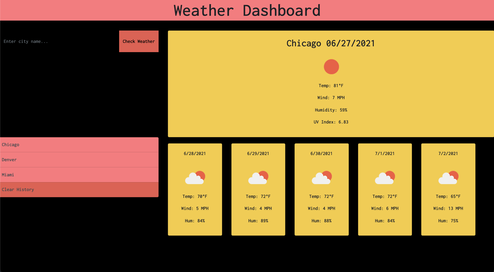
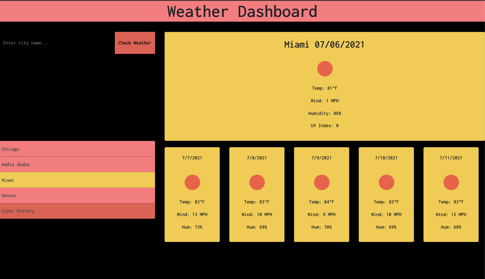

# GitHub Project: Weather App
# GitHub Deployed Link: https://natnaelh14.github.io/weather-app/

Technologies Used : HTML, CSS, Bootstrap, API, Javascript

In this project, I set out to create a weather app that provides current weather and 5 days forecast using user's input 
(city name). In order to achieve this, I used openweathermap API to retrieve the weather data and then I extracted pertinent
information by dynamically parsing the data. I used three separate APIs (Current Weather based on city, UV Index  based on
lan and lon, and 5 day forecast). For the 5 day for forecast, I averaged the weather data, as the information is in 3 hour
increments. I utilized moment js to add date information. I then used jquery to append the weather information to html. I used
bootstrap cards and jumbotron to build out the html. I add styling using bootstrap and vanilla CSS.  I appreciate any feedback.
Thanks!

Copyright (c) 2021 Natnael Haile (https://www.linkedin.com/in/natnael-haile-b146b41bb/)

Permission is hereby granted, free of charge, to any person obtaining
a copy of this software and associated documentation files (the
"Software"), to deal in the Software without restriction, including
without limitation the rights to use, copy, modify, merge, publish,
distribute, sublicense, and/or sell copies of the Software, and to
permit persons to whom the Software is furnished to do so, subject to
the following conditions:

The above copyright notice and this permission notice shall be
included in all copies or substantial portions of the Software.

THE SOFTWARE IS PROVIDED "AS IS", WITHOUT WARRANTY OF ANY KIND,
EXPRESS OR IMPLIED, INCLUDING BUT NOT LIMITED TO THE WARRANTIES OF
MERCHANTABILITY, FITNESS FOR A PARTICULAR PURPOSE AND
NONINFRINGEMENT. IN NO EVENT SHALL THE AUTHORS OR COPYRIGHT HOLDERS BE
LIABLE FOR ANY CLAIM, DAMAGES OR OTHER LIABILITY, WHETHER IN AN ACTION
OF CONTRACT, TORT OR OTHERWISE, ARISING FROM, OUT OF OR IN CONNECTION
WITH THE SOFTWARE OR THE USE OR OTHER DEALINGS IN THE SOFTWARE.